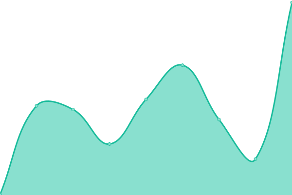
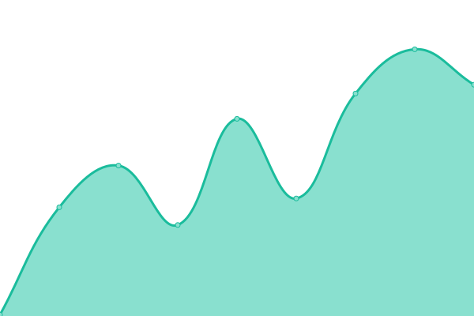

# [📈 Live Status](https://upptime.github.io/upptime): <!--live status--> **🟧 Partial outage**

This repository contains the open-source uptime monitor and status page for [Upptime](https://upptime.js.org), powered by [Upptime](https://github.com/upptime/upptime).

With [Upptime](https://upptime.js.org), you can get your own unlimited and free uptime monitor and status page, powered entirely by a GitHub repository. We use [Issues](https://github.com/upptime/upptime/issues) as incident reports, [Actions](https://github.com/Shiroo.ai/shiroo-uptime-monitor/actions) as uptime monitors, and [Pages](https://upptime.github.io/upptime) for the status page.

<!--start: status pages-->
<!-- This summary is generated by Upptime (https://github.com/upptime/upptime) -->
<!-- Do not edit this manually, your changes will be overwritten -->
<!-- prettier-ignore -->
| URL | Status | History | Response Time | Uptime |
| --- | ------ | ------- | ------------- | ------ |
|  [Shiroo App Production](https://app.shiroo.ai) | 🟩 Up | [shiroo-app-production.yml](https://github.com/Shiroo-ai/shiroo-uptime-monitor/commits/HEAD/history/shiroo-app-production.yml) | 

 595ms
     
 | 

<a href="https://Shiroo-ai.github.io/shiroo-uptime-monitor/history/shiroo-app-production">100.00%</a>
    

|  [Shiroo App Staging](https://app.shiroo.staging.araiko.ai) | 🟩 Up | [shiroo-app-staging.yml](https://github.com/Shiroo-ai/shiroo-uptime-monitor/commits/HEAD/history/shiroo-app-staging.yml) | 

 680ms
     
 | 

<a href="https://Shiroo-ai.github.io/shiroo-uptime-monitor/history/shiroo-app-staging">100.00%</a>
    

|  [Shiroo API Production](https://w1uco5w4y9.execute-api.eu-west-3.amazonaws.com/v1/) | 🟩 Up | [shiroo-api-production.yml](https://github.com/Shiroo-ai/shiroo-uptime-monitor/commits/HEAD/history/shiroo-api-production.yml) | 

 458ms
     
 | 

<a href="https://Shiroo-ai.github.io/shiroo-uptime-monitor/history/shiroo-api-production">100.00%</a>
    

|  [Shiroo API Staging](https://cwws8q8ex0.execute-api.eu-west-3.amazonaws.com/v1/) | 🟩 Up | [shiroo-api-staging.yml](https://github.com/Shiroo-ai/shiroo-uptime-monitor/commits/HEAD/history/shiroo-api-staging.yml) | 

 451ms
     
 | 

<a href="https://Shiroo-ai.github.io/shiroo-uptime-monitor/history/shiroo-api-staging">100.00%</a>
    

|  [Shiroo website](https://www.shiroo.ai/) | 🟩 Up | [shiroo-website.yml](https://github.com/Shiroo-ai/shiroo-uptime-monitor/commits/HEAD/history/shiroo-website.yml) | 

 476ms
     
 | 

<a href="https://Shiroo-ai.github.io/shiroo-uptime-monitor/history/shiroo-website">100.00%</a>
    

|  [Shiroo AI Chat Completions](https://status.openai.com/api/v2/components/01JMXBRMFE6N2NNT7DG6XZQ6PW.json) | 🟥 Down | [shiroo-ai-chat-completions.yml](https://github.com/Shiroo-ai/shiroo-uptime-monitor/commits/HEAD/history/shiroo-ai-chat-completions.yml) | 

 2902ms
     
 | 

<a href="https://Shiroo-ai.github.io/shiroo-uptime-monitor/history/shiroo-ai-chat-completions">4.56%</a>
    

|  [Shiroo AI Responses](https://status.openai.com/api/v2/components/01JP8CD9JR3HR6Y7G4Q75N4DVW.json) | 🟥 Down | [shiroo-ai-responses.yml](https://github.com/Shiroo-ai/shiroo-uptime-monitor/commits/HEAD/history/shiroo-ai-responses.yml) | 

 213ms
     
 | 

<a href="https://Shiroo-ai.github.io/shiroo-uptime-monitor/history/shiroo-ai-responses">4.56%</a>
    

|  [Shiroo AI Audio Transcriptions](https://status.openai.com/api/v2/components/01JMXBRMFEKVBWKK82B44QFMCE.json) | 🟥 Down | [shiroo-ai-audio-transcriptions.yml](https://github.com/Shiroo-ai/shiroo-uptime-monitor/commits/HEAD/history/shiroo-ai-audio-transcriptions.yml) | 

 144ms
     
 | 

<a href="https://Shiroo-ai.github.io/shiroo-uptime-monitor/history/shiroo-ai-audio-transcriptions">4.56%</a>
    

<!--end: status pages-->

[**Visit our status website →**](https://upptime.github.io/upptime)

## 📄 License

- Powered by: [Upptime](https://github.com/upptime/upptime)
- Code: [MIT](./LICENSE) © [Anand Chowdhary](https://anandchowdhary.com), supported by [Pabio](https://pabio.com)
- Data in the `./history` directory: [Open Database License](https://opendatacommons.org/licenses/odbl/1-0/)
